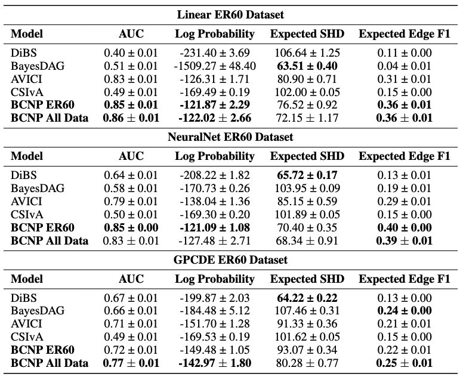
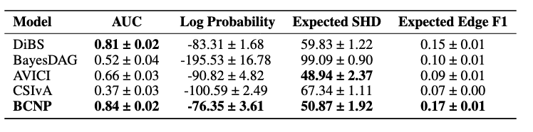

# A Meta-Learning Approach to Bayesian Causal Discovery

This repository is the official implementation of [A Meta-Learning Approach to Bayesian Causal Discovery](https://arxiv.org/abs/2412.16577).

We use a transformer based meta-learning approach to directly approximate the Bayesian posterior over causal structures. It learns a map $\mathcal{D} \to P(\mathcal{G}| \mathcal{D})$.

Inferring causal structure from observational data is a difficult task, namely due to identifiability issues and finite sample effects. As such, it is important to be able to quantify uncertainty over causal structure to facilitate downstream data collection (such as through active learning) that may increase the confidence over a single causal structure.

The main issue with computing the posterior over causal structures is two fold:
1. It requires inference over the causal mechanism, which can be intractable
2. The number of causal structures increases super-exponentially with the number of variables

We tackle the above issues by using a transformer neural process to directly learn the posterior over casual strucure. It implicitly marginalises the causal mechanism without explicit calculation, and handles the high dimensional causal space better than other causal structure learning methods.

The model implicitly learns a prior that depends on the data generating process of the training datasets. These datasets can be samples from explicit Bayesian models (examples in `datasets/functions_generator.py`) or datasets found in the wild. A large number of training datasets are required to learn a good prior. If very few datasets are available, we recommend training on samples from a wide variety of explicit Bayesian models (form which you can generate an unlimited number of datasets), and finetuning on the smaller number of datasets.


## Requirements

To install requirements:

```setup
pip install -e .
pip install -r requirements.txt
```

## Data Generation

Data can be generated from `ml2_meta_causal_discovery/datasets/create_save_synth_data.py`. It will be stored in the folder `ml2_meta_causal_discovery/datasets/data/synth_training_data`.

## Training

After generating data (including validtion and test data), you can train a model from `ml2_meta_causal_discovery/experiments/causal_classification`:

```train
python train_causal_classify.py --work_dir <path_to_root> --data_file <name_of_data_file> --run_name <run_name>
```

The model will be saved in `ml2_meta_causal_discovery/experiments/causal_classification/models/<run_name>`

An example of a trianing run is shown in `ml2_meta_causal_discovery/experiments/causal_classification/tnp_classifier.sh`.

## Evaluation

To evaluate the metrics for the trained model:

```eval
python test_causal_classify.py --model_list <run_name>
```

The metrics are stored under `ml2_meta_causal_discovery/experiments/causal_classification/models/<run_name>`.


## Results

Our model outperforms explicit Bayesian models and other meta-learning approaches:



We also test our method on a semi-synthetic dataset where our model was *only trained on synthetic datasets*:


